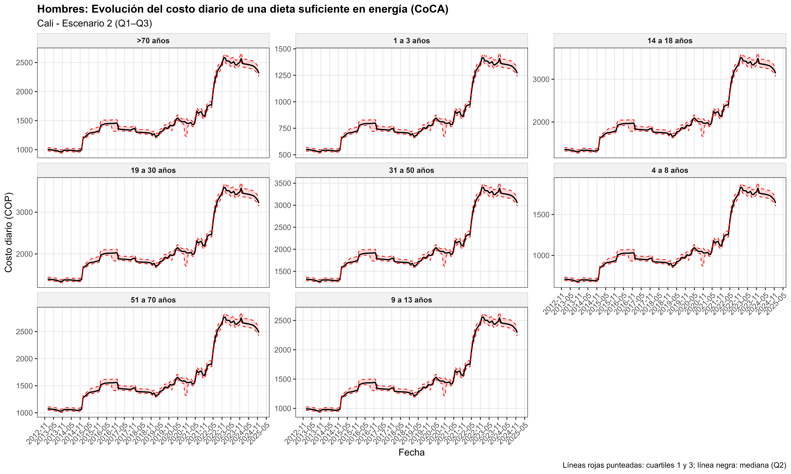
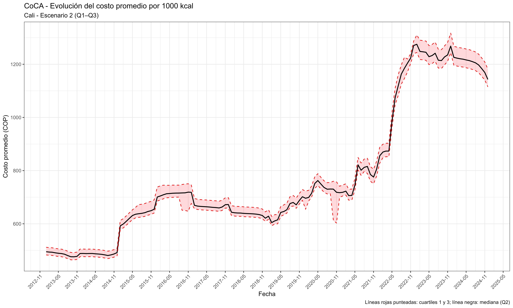
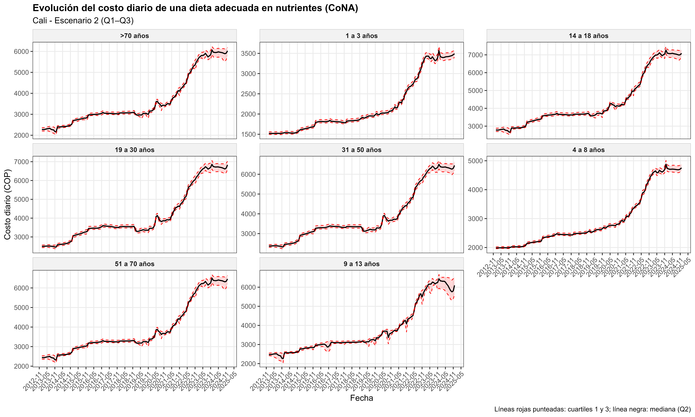
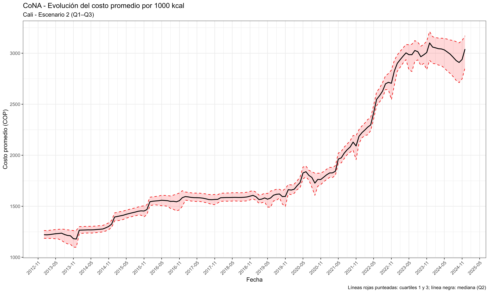
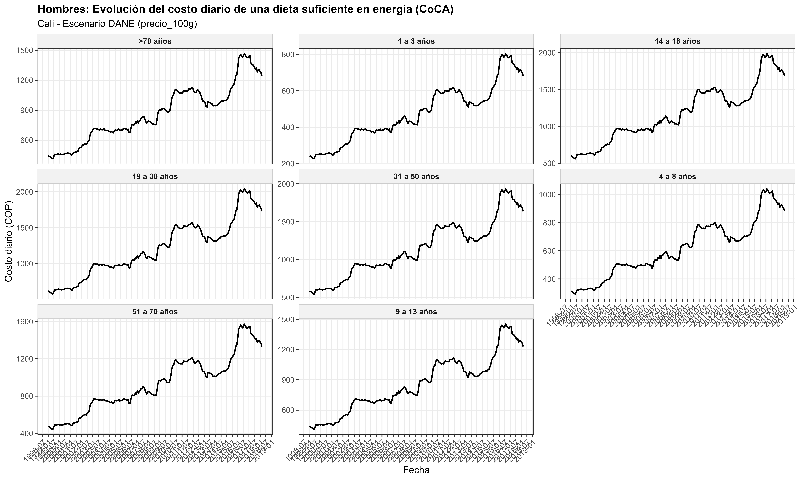
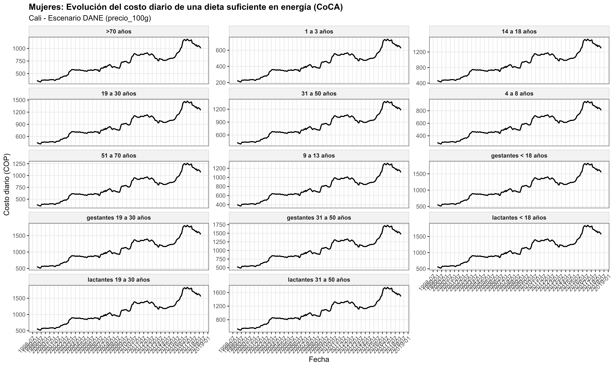
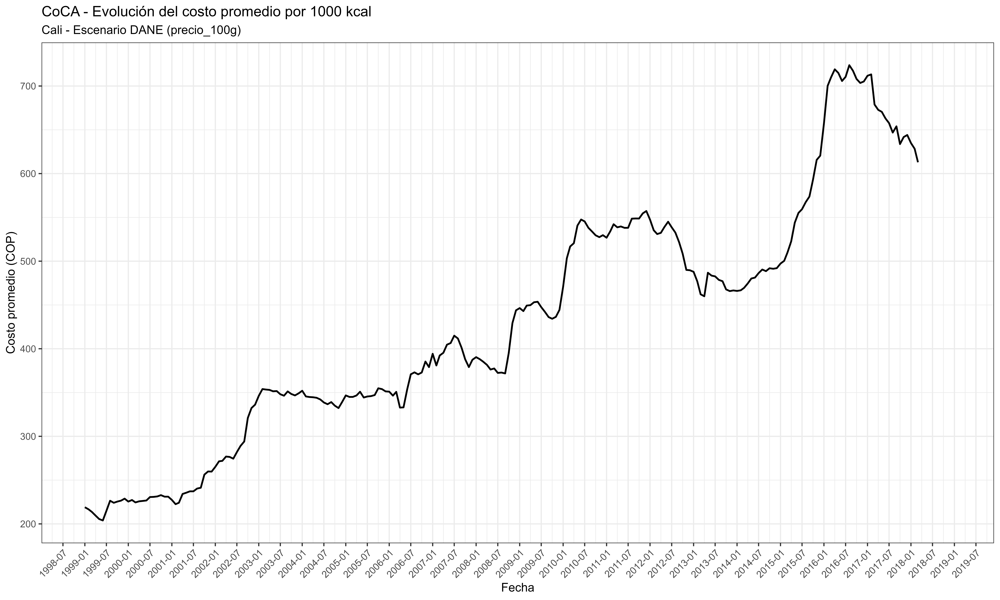
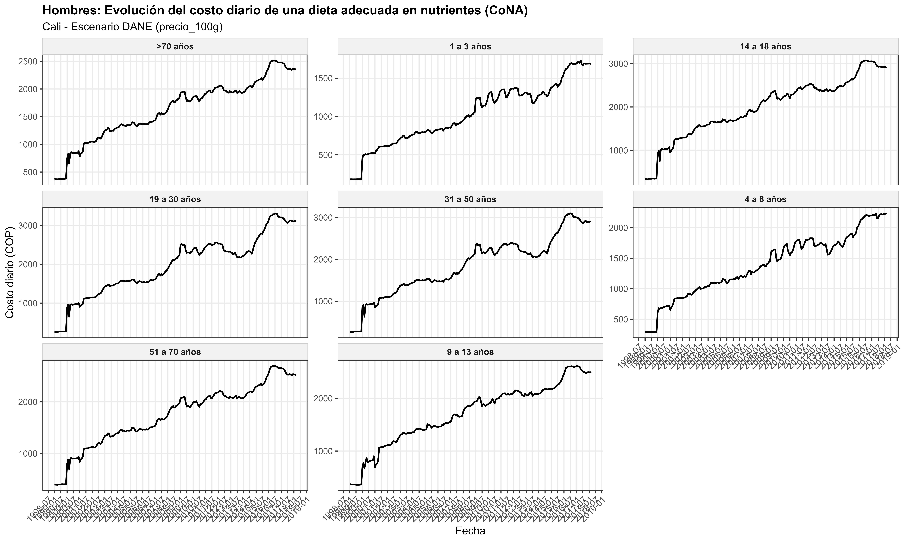
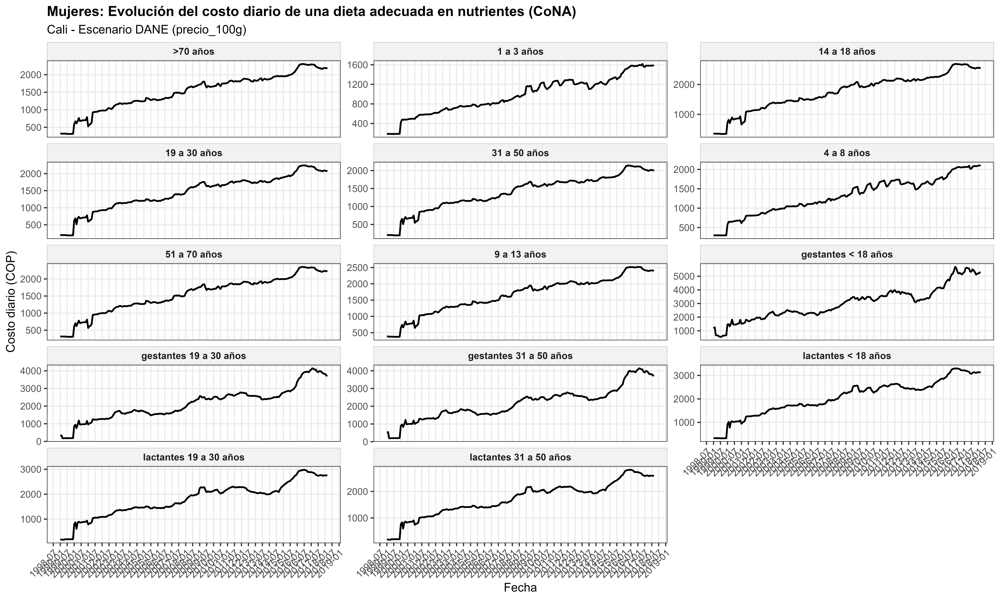
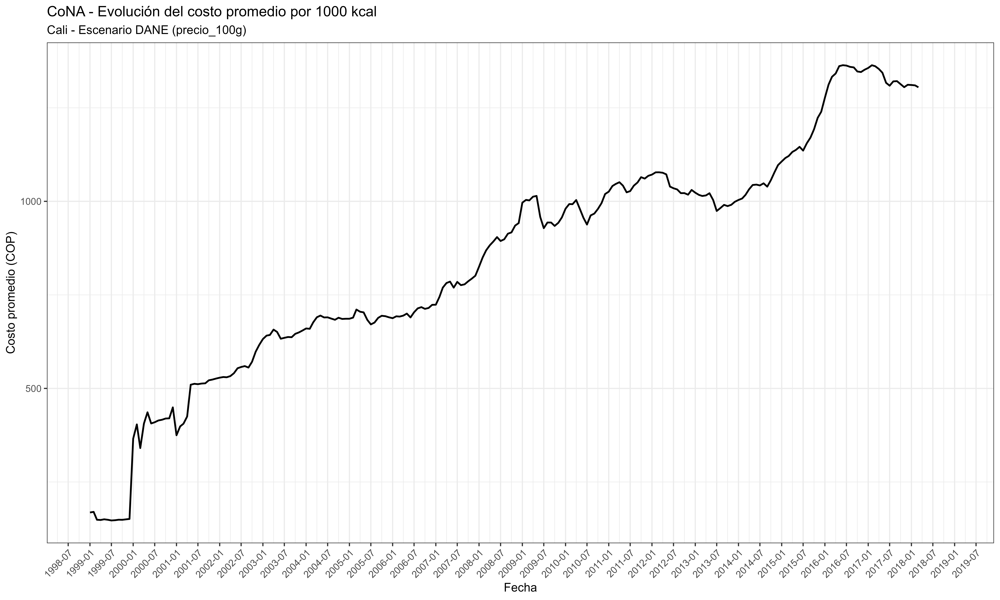

```{r setup, include=FALSE}
knitr::opts_chunk$set(echo = TRUE)
```

# Presentación

El objetivo del presente documento de trabajo es estimar el costo y la asequibilidad en tres ciudades principales de Colombia (Cali, Medellín y Bogotá) a tres niveles crecientes de calidad de la dieta. Para ello, se utilizan tres métricas basadas en dietas de costo mínimo: (1) el costo mínimo de una dieta suficiente en energía (CoCA); (2) el costo mínimo de una dieta adecuada en nutrientes (CoNA); y el costo mínimo de una dieta saludable o recomendada (CoRD). 

En la versión actual del documento se presentan tres estrategias para la estimación de las métricas anteriores:

- Escenario 1: Estimación de las métricas a partir de datos proporcionados por el DANE desde enero de 1999 hasta marzo de 2018, que corresponden a la encuesta nacional de precios que se conduce mensualmente para el cálculo del IPC.

- Escenario 2: Para extender el cálculo en el tiempo, se calculan margenes de comercialización, a partir de los datos de precios mayoristas de SIPSA y los datos de precios proporcioandos por el DANE, las métricas son estimadas bajo tres escenarios de los margenes para cada artículo: Q1, Q2 y Q3.


 
# Contexto 

# Datos

# Metodología

# Resultados

## Análisis sobre los márgenes de comercialización


## Caso de estudio 1: Cali


### Escenario 1: Estimación según la distribución del margen de comercialización


#### Estimaciones CoCA


{width=75%}

{width=75%}

{width=75%}


#### Estimaciones CoNA

{width=75%}

{width=75%}

{width=75%}


### Escenario 2: Precios minoristas a partir de datos IPC

#### Estimaciones CoCA


{width=75%}

{width=75%}

{width=75%}


#### Estimaciones CoNA

{width=75%}

{width=75%}

{width=75%}


### Escenario 3: Resultados recientes utilizando web scraping


## Caso de estudio 2: Medellín


## Caso de estudio 3: Bogotá
